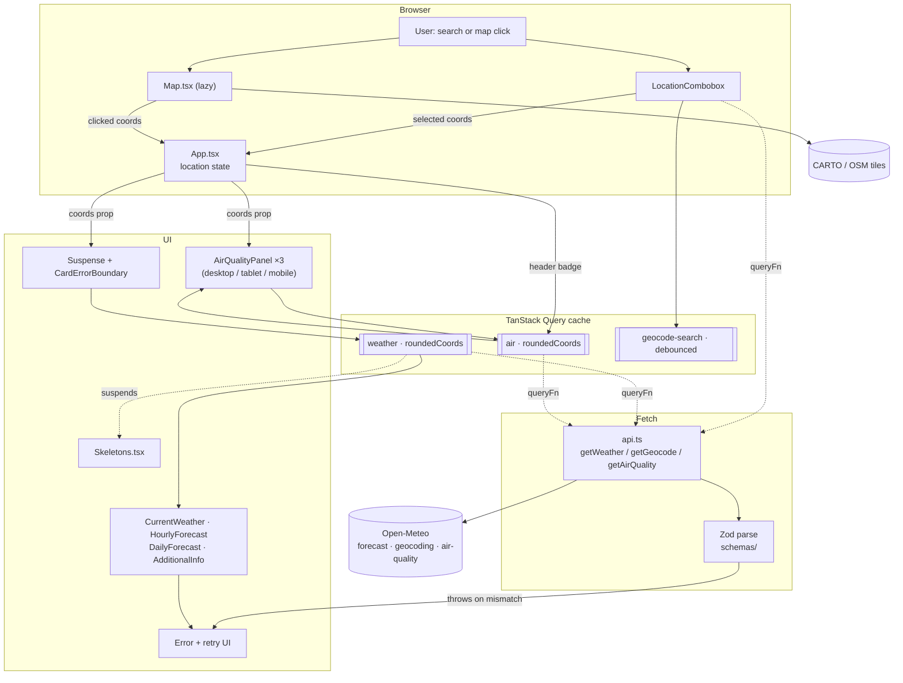

# Architecture

## Folder structure

```
src/
├── main.tsx                     React root. Creates the QueryClient and mounts
│                                QueryClientProvider → ThemeProvider → UnitProvider → App.
├── App.tsx                      Layout shell. Owns location state, Suspense
│                                boundaries, error boundaries and responsive
│                                grid placement.
├── api.ts                       The ONLY module that performs network I/O.
│                                Wraps the three Open-Meteo endpoints and
│                                reshapes responses.
├── types.ts                     Shared `Coords` type.
├── index.css                    Tailwind entry point + design tokens.
├── components/
│   ├── Header.tsx               Sticky bar: location slot, unit + theme
│   │                            toggles, mobile AQI button.
│   ├── LocationCombobox.tsx     Debounced search, keyboard nav, geolocation.
│   ├── Map.tsx                  Leaflet map, custom marker, flyTo, theme-aware
│   │                            basemap.
│   ├── AirQualityPanel.tsx      AQI headline + per-pollutant cards.
│   ├── MobileAirQualitySheet.tsx  <768px bottom sheet wrapping the panel.
│   ├── CardErrorBoundary.tsx    Class error boundary with retry UI.
│   ├── OfflineBanner.tsx        Connectivity watcher.
│   ├── ThemeToggle.tsx          Light/dark switch.
│   ├── UnitToggle.tsx           Celsius/Fahrenheit switch.
│   ├── WeatherIcon.tsx          WMO code → Weather Icons font glyph.
│   ├── cards/
│   │   ├── Card.tsx             Shared card shell (title, actions, class merge).
│   │   ├── CurrentWeather.tsx
│   │   ├── HourlyForecast.tsx   48 hours.
│   │   ├── DailyForecast.tsx    8 days, with range bars.
│   │   ├── AdditionalInfo.tsx   Cloud, UV, wind, pressure, sunrise/sunset.
│   │   └── Skeletons.tsx        One loading skeleton per card.
│   └── ui/                      shadcn/ui generated components. Currently
│                                unused by the app.
├── hooks/
│   ├── useWeather.ts            useSuspenseQuery, key ["weather", coords].
│   └── useAirQuality.ts         useQuery, key ["air", coords].
├── schemas/
│   ├── weatherSchema.ts         Zod shape returned by getWeather().
│   ├── airQualitySchema.ts      Raw + normalized air-quality shapes.
│   └── geoCodeSchema.ts         Raw + normalized geocoding shapes.
├── lib/
│   ├── utils.ts                 `cn` re-export + roundCoords().
│   └── formatters.ts            Unit conversion, compass points, UV bands,
│                                timezone-aware time/day formatting.
├── constants/
│   └── airQuality.ts            European AQI bands and pollutant thresholds.
└── context/
    ├── themeContext.ts          ThemeContext + useTheme().
    ├── ThemeProvider.tsx        Theme state, localStorage, DOM class sync.
    ├── unitContext.ts           UnitContext + useUnit().
    └── UnitContext.tsx          Unit state, localStorage.
```

`src/assets/weather-icons/` is a vendored third-party icon font and is not part
of the application source.

---

## Data flow



### The path a temperature takes

1. The user types a city or clicks the map.
2. `App` resolves the selection into `coords` and writes it to the URL and
   `localStorage`.
3. Each forecast card calls `useWeather(coords)`.
4. `useWeather` rounds the coordinates to 2 decimal places via `roundCoords()`
   and uses that as the query key.
5. TanStack Query finds a cache hit, or calls `getWeather()` in `api.ts`.
6. `getWeather()` builds the query string, `fetch`es Open-Meteo, reshapes the
   parallel arrays into records, and hands the result to `weatherSchema.parse()`.
7. The parsed object lands in the cache and every subscribing card re-renders.
8. Cards render through `src/lib/formatters.ts`, which converts Celsius to the
   unit chosen in `UnitContext`.

Because steps 3–4 are identical for all four cards, **one user interaction
produces one HTTP request**.

---

## Module roles

### `api.ts` — network boundary

Sole owner of `fetch`. Three exported functions, one per endpoint. It is
responsible for:

- building query strings,
- throwing on non-2xx responses with the status in the message,
- reshaping Open-Meteo's index-based arrays into keyed records,
- renaming fields to the internal shape,
- validating the result with Zod before returning.

Keeping this in one module is what makes "which hosts does this app talk to?"
answerable by reading a single file.

### `schemas/` — the contract

Zod schemas are the single source of truth for response types. `weatherSchema`
is not merely a runtime guard: `z.infer<typeof weatherSchema>` produces the
`Weather` type, so a schema edit and a type edit are the same edit. Parsing
happens inside `api.ts`, so a malformed upstream payload throws at the boundary
instead of surfacing as `NaN` in the UI.

### `hooks/` — the cache boundary

Both hooks are the only sanctioned way to read server state. Centralising the
query key and fetcher in one function per resource is what guarantees they
cannot drift apart between components.

| Hook | Query | Consumers | Deduplication |
| --- | --- | --- | --- |
| `useWeather` | `["weather", roundedCoords]` | 4 cards | 4 → 1 request |
| `useAirQuality` | `["air", roundedCoords]` | 3 panels + header badge | 4 → 1 request |

### `context/` — client preferences

`ThemeProvider` and `UnitProvider` hold cross-cutting display preferences that
many unrelated components need. Unlike location, drilling these through props
would mean threading them through every card, so Context is the right tool here.
Both persist to `localStorage` (`atmos_theme`, `atmos_unit`) inside `try/catch`
blocks so private-browsing failures are non-fatal.

### `components/cards/` — presentation only

Cards receive `coords` as a prop and read data via `useWeather`. They contain no
fetching, no caching policy and no unit arithmetic beyond calling the helpers in
`lib/formatters.ts`.

---

## Caching strategy

Configured once in `src/main.tsx`:

| Option | Value | Rationale |
| --- | --- | --- |
| `staleTime` | 10 minutes | Forecast data does not change materially in minutes; avoids refetch storm while scrubbing the map. |
| `gcTime` | 30 minutes | Garbage-collects abandoned locations reasonably promptly. |
| `refetchOnWindowFocus` | `true` | Refresh when the user returns to the tab. |
| `retry` | max 2, **never on 4xx** | A `400` or `429` will not succeed on retry; retrying wastes quota and delays the error UI. Detected by matching a 4xx status in the error message thrown by `api.ts`. |
| `retryDelay` | `1000 * 2^attempt`, capped at 30 s | Exponential backoff. |
| `placeholderData` | `keepPreviousData` | The previous location's data stays on screen while the new location loads, instead of flashing skeletons. |

Geocoding opts into a **1 hour** `staleTime` of its own, in
`LocationCombobox` — place names and their coordinates are effectively static.

Two further mechanisms reduce requests:

1. **Coordinate rounding** — `roundCoords()` quantises to 2 dp (~1.1 km) before
   the key is built, so clicking nearby points reuses a cache entry.
2. **Map-click debouncing** — 150 ms in `App`, preventing a request per click
   event during a drag.

---

## Error-handling strategy

Atmos uses two different patterns on purpose.

### Weather: suspend, then catch

```
<CardErrorBoundary>          ← class component, catches render + suspend errors
  <Suspense fallback={<Skeleton/>}>
    <Card coords={coords}/>  ← calls useSuspenseQuery
  </Suspense>
</CardErrorBoundary>
```

- **Suspension** means each card has its own loading skeleton
  (`Skeletons.tsx`) that mirrors the real card's layout, so nothing jumps when
  data lands.
- **`CardErrorBoundary`** is a class component, which is the only way to catch
  rendering and suspended-tree errors. It classifies the failure by inspecting
  the error message:

  | Message contains | Rendered as |
  | --- | --- |
  | `429` | "Rate limited" |
  | `Failed to fetch`, `NetworkError`, `Load failed` | "Network error" |
  | `ZodError`, `parse`, `schema` | "Data error" |
  | anything else | "Something went wrong" |

  Each state offers a **Retry** button that clears the boundary's error state.
- The map is deliberately **outside** these boundaries. It does not suspend, and
  remounting `MapContainer` would rebuild the Leaflet instance and discard the
  user's zoom and pan.

### Air quality: branch inline

`useAirQuality` uses plain `useQuery`, so `AirQualityPanel` checks `isLoading`
and `isError` itself and returns a placeholder or a "currently unavailable"
message. Air quality is a secondary panel, not a primary card, so a full
skeleton-and-boundary treatment is not warranted.

### Connectivity

`OfflineBanner` subscribes to `window`'s `online`/`offline` events and shows a
dismissible notice. It does **not** prevent TanStack Query from trying — the
per-card error boundary handles the resulting failure.

---

## Rendering and responsiveness

`App.tsx` owns the layout grid. Cards are ordered for mobile and repositioned
for `xl` with explicit `order-*`, `xl:col-start-*` and `xl:row-span-*` utilities,
so the daily forecast spans two rows beside the current and hourly cards on
wide screens.

The air-quality panel is rendered **three times** with different containers —
a sticky `xl` sidebar, an `md`–`xl` grid, and a `<768px` bottom sheet — because
the same component must appear in structurally different places at different
breakpoints. This is not wasteful: TanStack Query collapses all three into one
request.

The map is loaded with `React.lazy`, which splits Leaflet and its CSS into a
separate chunk (roughly 155 kB uncompressed) so it is not parsed on first paint
of the cards.
